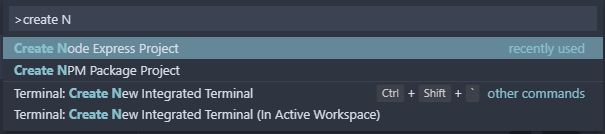
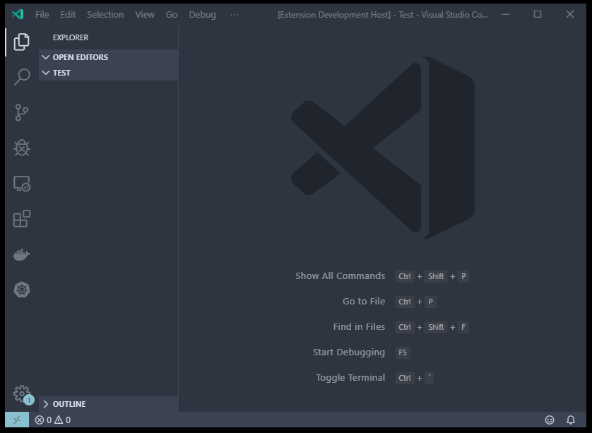

# Gimme Boilerplate

Gimme Boilerplate is an extension that will enable you to create the basic boilerplate for the following projects:

1. For your Node Express Porject
1. NPM Package Project

## Using the Extensions

Search for the extension in VSCode and Install it.
You can start using the extension from the Command Pallette (`Ctrl + Shift + P`).

Try out the following commands:

- `Create Node Express Project` - Creates a Node Express project for your with all the necessary files and folders.
- `Create a NPM Package Project` - Create the boilerplate for starting an NPM Package.

**Features for Node Express Boilerplate**

- Fully in Typescript
- Scalable Folder Structure
- Test configurations added (Jest).
- Works out of the box.
- Logging with Winston and Morgan
- .env file for configurations
- Scripts added in Package.json
- Readme template

**Features for NPM Package Boilerplate**

- Fully in Typescript
- Simple Folder Structure
- Test configurations added (Jest).
- Works out of the box.
- Scripts added in Package.json
- Readme template
